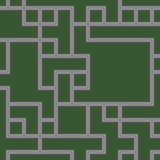
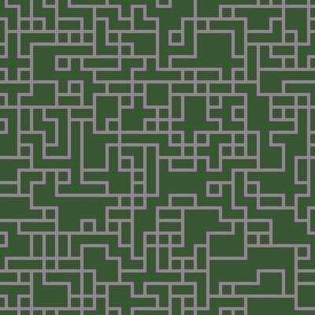
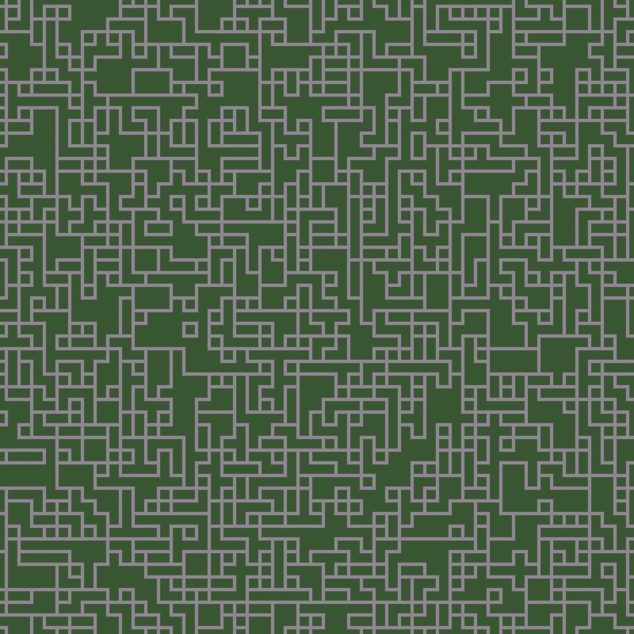

# Wave Function Collapse (WFC)

This is a short project that I wanted to try out and see what I could do.
I took an assortment of images and made a lookup table that allows them to link together procedurally using the program.

---

The program simply takes a lookup table as it iterates through the given array. The first image is chosen at random, and every other image is also chosen at random. A normal Wave Function Collapse Function would choose the cell with the least amount of possible items to choose from first, but this simply goes through it one cell to the next.

Some example images look like these. The first being 10x10, followed by 25x25, then 50x50.

While this isn't a "true" WFC program, it's a neat look into seeing a large map being generated and yielding different results while looking nice and crisp.

---

### Resources used:
###### - Python
    - Python's Random Library
    - Pillow
###### - Krita (images)
###### - Visual Studio Code
###### - Git