# Wave Function Collapse (WFC)

This is a short project that I wanted to try out and see what I could do.
I took an assortment of images and made a lookup table that allows them to link together procedurally using the program.

---

The program simply takes a lookup table as it iterates through the given array. The first image is chosen at random, and every other image is also chosen at random. A normal Wave Function Collapse Function would choose the cell with the least amount of possible items to choose from first, but this simply goes through it one cell to the next.

Some example images look like these. The first being 10x10, followed by 25x25, then 50x50.

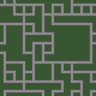
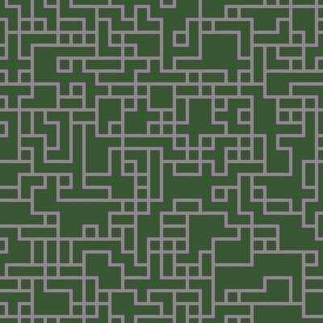
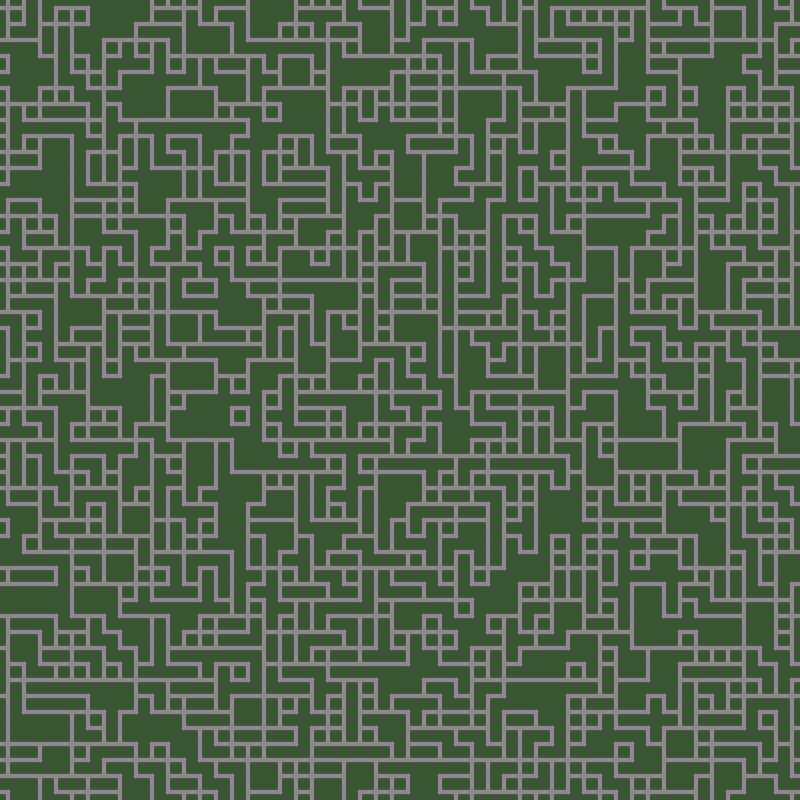

Depending on what you add in, the more complex items you add, the more complex your image will come out. The following 3 I added in some images that lead to a fork and those limit what happens across the board, leading to some more *interesting* results.

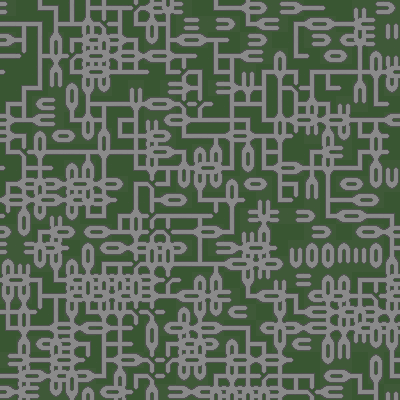
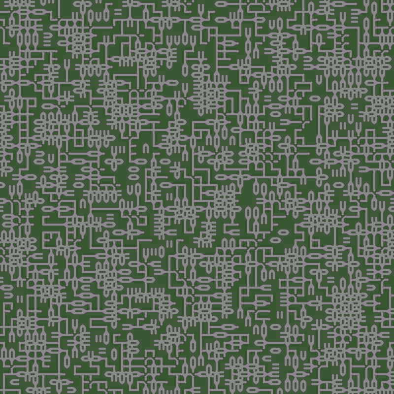

Adding in some more simple designs such as diagonals and general designs tend to allow for more complexity, with the result of more of a complex image than before.

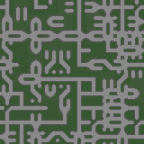
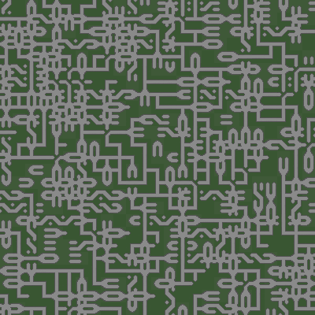
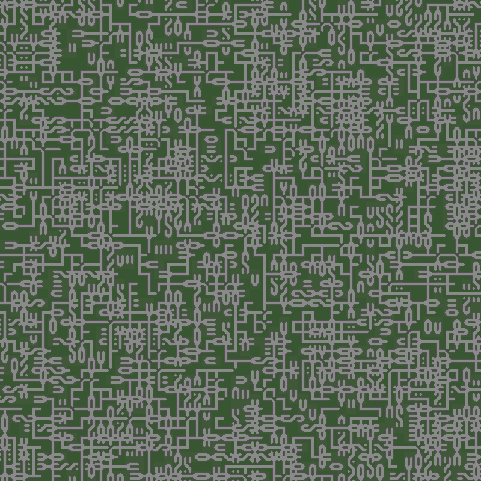

While this isn't a "true" WFC program, it's a neat look into seeing a large map being generated and yielding different results while looking nice and crisp.

---

Most of the tilesets (with the exception of the grass_and_stone file) used came from The Coding Train, as well as using his video as a guide to my own solution for this problem. You can check out his video <a href="https://www.youtube.com/watch?v=rI_y2GAlQFM&t=3649s">here.</a>

The Following images are from The Coding Train's Assets and are merely only used to show the adaptibility and view of other possibilities using other assets and tiles.

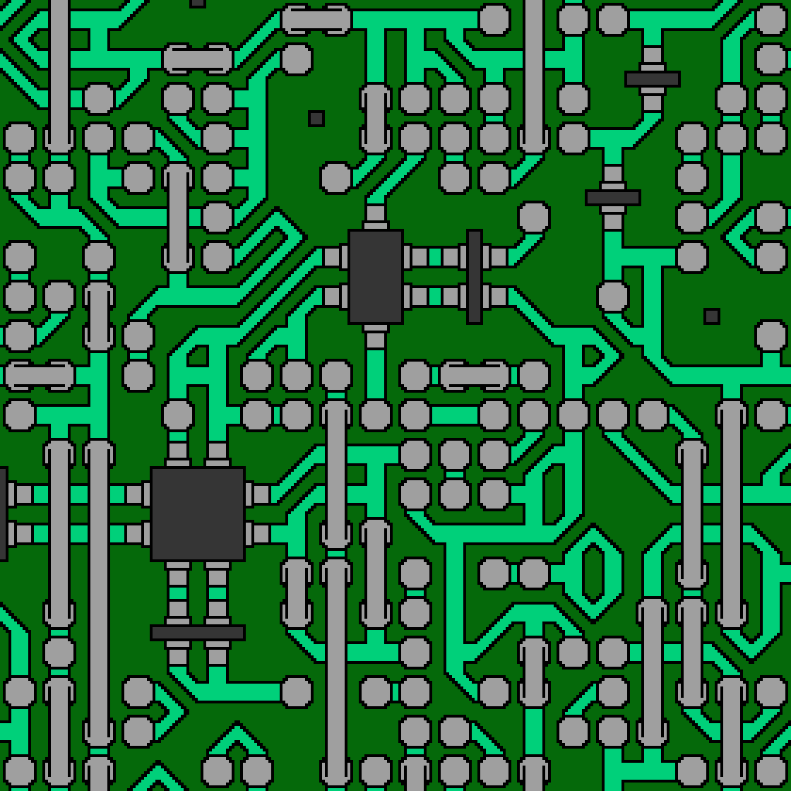

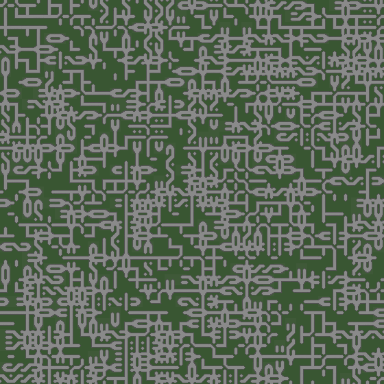
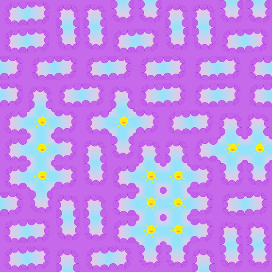
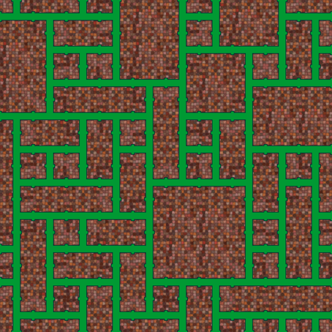
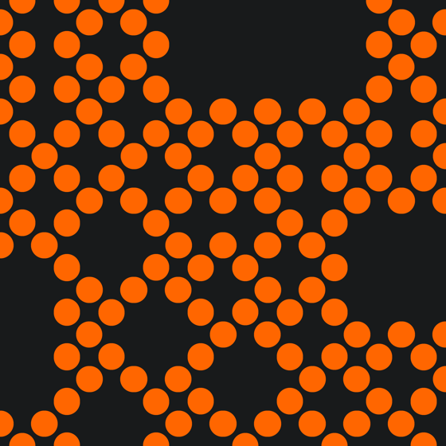
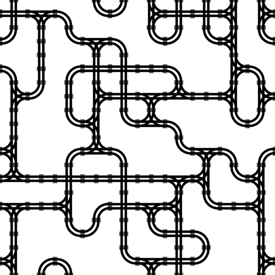

---

### Resources used:
###### - Python
    - Python's Random Library
    - Pillow
###### - Krita (images)
###### - Visual Studio Code
###### - Git
- [The Coding Train YouTube Video](https://www.youtube.com/watch?v=rI_y2GAlQFM&t=3649s)